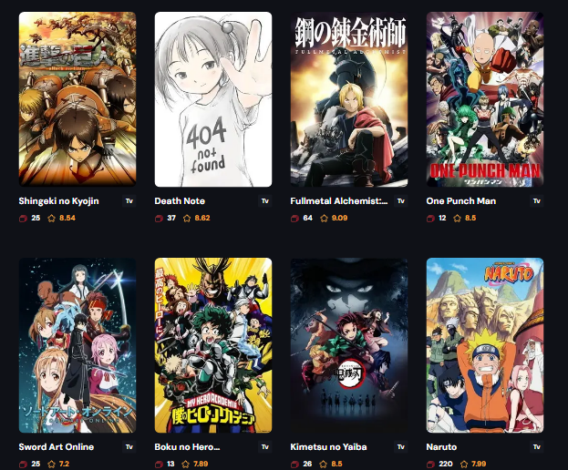

# Anime Store With Next.js Server actions

- The project fetches animes from an API on the server
- Having an infinite scroll animation (on scroll pagination)

## Screenshot

## Links

- Live Site URL: [Vercel](https://getlinked-mu.vercel.app/)

## Built With

- Semantic HTML5 markup
- Tailwindcss
- Next.js
- API
- Framer Motion
- React-Vertical-Timeline-Component
- Mobile-first workflow

## Author

- LinkedIn - [@JeremiahChinwe](https://www.linkedin.com/in/jeremiah-chinwe-057180268)
- Twitter - [@jeremiahchinwe](https://www.twitter.com/jeremiahchinwe)

